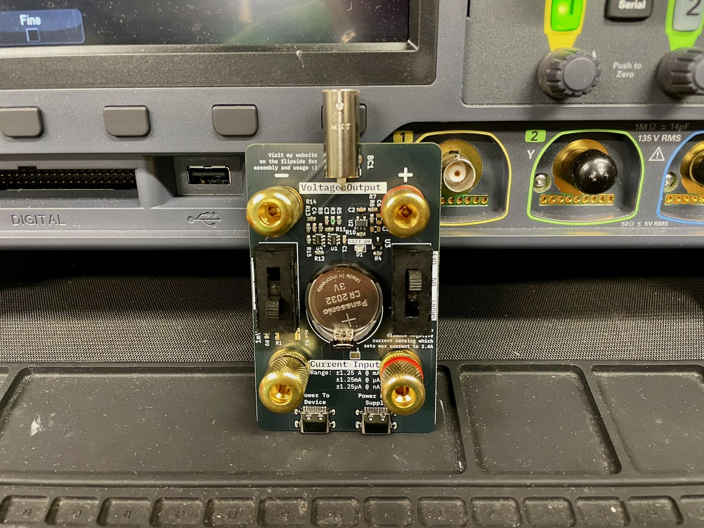
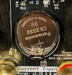
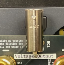
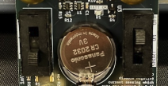
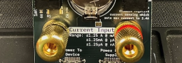
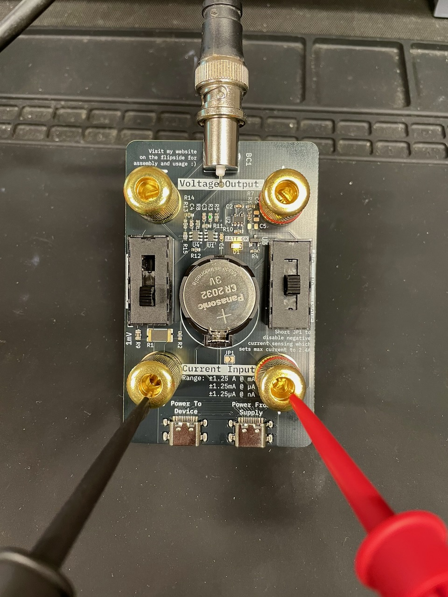

# Ziyue's Namecard

> An enhanced µCurrent Gold and tinyCurrent Derivative

Hi, Ziyue here! You probably received my namecard and you might be wondering what it is or how to use it. It is a fully functional professional low current measurement device, derived from the [µCurrent](https://www.eevblog.com/projects/ucurrent/) made by Dave Jones of EEVBLOG fame, and [tinyCurrent](https://github.com/nfhw/tinycurrent) by [n-fuse GmbH](https://www.n-fuse.co/contact.html). Handy for an EE engineer and a great addition to any EE lab. 

This version has several enhancements that makes it even better for measuring modern devices, especially if you work extensively with USB powered and embedded MCU / RF devices with fast current transients:

- **BNC Connector** to reduce pickup noise while measuring with an oscilloscope. You can use a short BNC female-female adapter to plug this device directly into your oscilloscope instead of relying on a banana jack to BNC cable
- **Higher Positive Dynamic Current Range** by soldering the JP1 jumper closed, up to 2.5A. This will disable sensing of negative currents, which will be clipped to 0V on the voltage output
- **Dedicated USB-C Ports** for current profiling a USB device directly, such as a microcontroller, RF module or other power constrained IoT devices
- **SMD Pads for optional C5, C6 capacitors** to add capacitors on virtual ground rails which prevents oscillation with capacitive loads

## Kit Contents

- PCB with all SMD components pre-soldered
- 2x DP3T switches
- 4x Banana jacks, 2 red and 2 black
- 1x CR2032 battery holder
- 1x BNC connector

Batteries not included, you will need to use your own CR2032 battery

Please solder the through hole components onto the board as per the instructions below.

> [!WARNING]
> The first revision of this board has a silkscreen defect. The battery holder must be soldered in the OPPOSITE direction as indicated by the silkscreen. Refer to the image in the steps below for the correct orientation

1. Solder the CR2032 battery holder
    - 
    - Alternatively, you can also solder wires directly to the battery terminals to attach an external power supply. Ensure your choice of external power is extremely linear with very low noise. Primary cells such as batteries are most suitable for this
2. Solder the BNC connector
    - 
3. Solder the two DP3T slide switches
    - 
4. Screw in the 4 banana jacks into all of the terminals, ensuring that the colors are matched to the positive/negative terminals
    - 
5. (Optional) Solder the JP1 jumper if you do not intend to measure any negative currents. Doing this will double the dynamic range of the device.

## Usage

1. Connect the device under test in loop **on the low side** so that the current flow is from **+** to **-**.
2. Connect a suitable voltage measurement device such as a digital multimeter or an oscilloscope (via BNC) on the output side via either the banana jacks or BNC connector.
3. Turn on the device and read the current on the voltage measurement device in the mV range as if it were mA/µA/nA.

A demo of using this device with an oscilloscope can be seen below:

## Specifications

### Absolute Maximum Ratings

| Parameter                        | Test Conditions | Min | Typ | Max | Unit |
| -------------------------------- | --------------- | --- | --- | --- | ---- |
| $I_{\text{max}}$ Maximum current |                 |     |     | 5   | A    |
| $V_{\text{cc}}$ Supply voltage   |                 |     |     | 5.5 | V    |

> WARNING: This device has NO input current protection to reduce burden voltage to a minimum. Do NOT overload the device.

### Electrical Characteristics

| Parameter                                             | Test Conditions             | Min   | Typ  | Max  | Unit   |
| ----------------------------------------------------- | --------------------------- | ----- | ---- | ---- | ------ |
| $I_{\text{nA}}$ Dynamic range of current in nA mode   | $V_{\text{cc}}=2.9\text{V}$ | -1250 |      | 1250 | nA     |
| $I_{\mu\text{A}}$ Dynamic range of current in µA mode | $V_{\text{cc}}=2.9\text{V}$ | -1250 |      | 1250 | µA     |
| $I_{\text{mA}}$ Dynamic range of current in mA mode   | $V_{\text{cc}}=2.9\text{V}$ | -1250 |      | 1250 | mA     |
| $V_{\text{cc}}$ Supply voltage                        |                             | 2.65  |      | 4.5    | V      |
| Resolution in nA mode                                 | On 3.5 digit DMM            |       | 1000 |      | pA     |
|                                                       | On 4.5 digit DMM            |       | 100  |      | pA     |
|                                                       | On 5.5 digit DMM            |       | 10   |      | pA     |
| Accuracy                                              | In µA and nA ranges         | -0.05 |      | 0.05 | %      |
|                                                       | In mA range                 | -0.1  |      | 0.1  | %      |
| $V_{\text{o,off}}$ Output Offset Voltage              |                             | -30   |      | 30   | µV     |
| Temperature Drift                                     | In µA and nA ranges         |       |      | 10   | ppm/˚C |
|                                                       | In mA range                 |       |      | 15   | ppm/˚C |
| Noise                                                 |                             |       |      | -90  | dBV    |
| THD                                                   |                             |       |      | -60  | dB     |
| Bandwidth (-3dB)                                      |                             |       | 300  |      | kHz    |

> Note that in nA mode, contact resistance will need to be accounted for, with an additional 10 µV bias on the output voltage due to the shunt resistor.

In ordinary operations in which virtual ground voltage $V_{\text{VGND}}=\frac{V_{\text{cc}}}{2}$, you can calculate the output voltage dynamic range using the formula:
$$
V_{\text{dynamic}} = \pm \left(\frac{V_{\text{cc}}}{2} - 200 \text{mV}\right)
$$

If you short the JP1 jumper, which sets the virtual ground voltage $V_{\text{VGND}}=0$, the new dynamic range will purely be in the positive range:
$$
V_{\text{dynamic}} = V_{\text{cc}} - 200 \text{mV}
$$

In general, this board has similar specifications to the [original µCurrent Gold](https://www.eevblog.com/projects/ucurrent/).

## Licenses

The circuit schematics of this project are made available under the
[CC-BY-SA](https://creativecommons.org/licenses/by-sa/3.0/) license.

